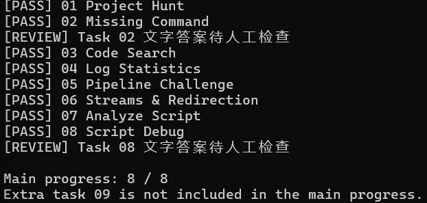

## Task 01：Project Hunt

- 使用 `ls -a workspace` 查看隐藏项，发现 `.project`。
- 使用 `ls -la workspace` 查看详细信息，确认 `.project` 是文件夹：权限信息以 `d` 开头。
- 使用 `ls -la workspace/.project` 找到普通文件 `metadata`。
- 使用 `cat workspace/.project/metadata` 查看内容，找到编号 `LSR-2026-0831`。
- 将编号写入 `output/01_project_id.txt`。
- 从 `workspace/src/utils/` 出发，需要返回两层，再进入 `.project`，所以相对路径是 `../../.project/metadata`，已写入 `output/01_relative_path.txt`。
- 运行 `./check.sh 01`，结果为 `[PASS] 01 Project Hunt`。

学到的要点：
- 以 `.` 开头的文件或文件夹默认隐藏，`ls -a` 可以显示。
- `..` 表示上一层目录，`.` 表示当前目录。
- `cat` 用于查看文本内容。
- `>` 把输出写入文件，会覆盖文件原有内容。

## Task 02：执行权限与 PATH

- `chmod +x 文件` 可以添加执行权限。
- `./tools/recruit-info` 给出了程序的具体路径；只输入 `recruit-info` 时，Shell 会按 PATH 查找。
- `export PATH="$PWD/tools:$PATH"` 可以在当前 Shell 会话中临时添加搜索目录。

## Task 03：文件搜索

- `find 目录 -type f` 会递归查找普通文件。
- `grep` 搜索文件内容；`sort -u` 可以排序并去重。

## Task 04：日志统计

- `grep -c` 可以统计匹配的行数。
- `cut` 提取字段；`sort` 后接 `uniq -c` 可以统计各值出现的次数。

## Task 05：管道

- `|` 将前一个命令的正常输出交给下一个命令。
- 多个命令可以连起来完成提取、计数和排序，不必创建中间文件。

## Task 06：输出流

- `>` 保存正常输出，`2>` 保存错误输出。
- `tee` 将收到的内容同时显示在终端并写入文件；普通管道默认只传递正常输出。

## Task 07：Bash 脚本

- `$1` 是第一个参数，`$#` 是参数个数，`$(...)` 可以取得命令的输出。
- 脚本应先检查参数和文件，再处理数据；出错时使用非零退出状态。

## Task 08：引号

- 未加引号的变量展开可能把带空格的路径拆开。
- `"$@"` 保留各个参数；`"$file"` 保持一个文件路径完整。

## 主线题检查结果

